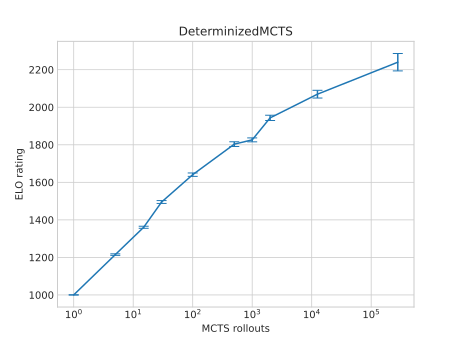

# Durak
Python and Rust implementation of [MCTS](https://en.wikipedia.org/wiki/Monte_Carlo_tree_search) to guide gameplay in the card game durak.

## Getting Started
Clone this repository.
```bash
git clone https://github.com/jorisperrenet/durak
cd durak
```
For the Python implementation, do:
```bash
cd python_version
python main.py
```
For the Rust implementation, do:
```bash
cd rust_version
cargo run
```

## Game Rules
This code implements the game of traditional [Durak](https://en.wikipedia.org/wiki/Durak) with reflecting.
Note:
- The attacker can only attack with one card at a time (which is irrelevant for gameplay if you think about it).
- Players can divert an attack by only showing their trump (which they can only do once that trick). This can only be done if no card is defended yet.
- This is an implementation of the 36-card version.
- The starting player is not the person with the lowest trump, the player must be set manually.

Gameplay is only available through the console.

## Types of Players

| Programming Language | Human | Random | DeterminizedMCTS | ISMCTS | ISMCTSFPV |
| -------------- | ----- | ------ | ---------------- | ------ | --------- |
| Python         | :heavy_check_mark:   | :heavy_check_mark:    | :heavy_check_mark:              | :heavy_check_mark:    | :heavy_check_mark:       |
| Rust           | :heavy_check_mark:   | :heavy_check_mark:    | :heavy_check_mark:, multi-threaded | :x:    | :x:       |

* Human — For interative gameplay. Asks what action the player performed or wants to perform if `computer_shuffle` is set to `true`.
* Random — Performs a random action.
* DeterminizedMCTS — Specify the amount of random deals / determinizations (filling in all incomplete information) and the amount of rollouts per deal, a regular MCTS is performed.
* ISMCTS — Specify the amount of rollouts of the MCTS, each turn a determinization of the players' hand is made.
* ISMCTSFPV — Same as ISMCTS, however, for other players this performs a random move instead of searching the tree.


## How can you use this to win in a real-life game?
* Set `computer_shuffle` to `false`, the program will ask you for the cards the person draws and for the actions of all other human players in the game.
* In the Rust implementation, you can set `confirm` to `true` for confirming the moves of the DeterminizedMCTS.


## Elo-rating of Players
This program can also be used to rate players, game are played head-to-head with each other.
Random players are set to an initial ELO rating of 1000. Players that have a 10 times higher chance to win (or better to not lose) will have an ELO rating of 400 higher.
See [this](https://en.wikipedia.org/wiki/Elo_rating_system#Mathematical_details) for more information on how to calculate the ELO rating of a player (the uncertainty/standard deviation was calculated using [this](https://en.wikipedia.org/wiki/Propagation_of_uncertainty#Simplification)).

<p align="center">
    
</p>

I lost against the DeterminizedMCTS version in Rust with 3.3 million simulations (30000 rollouts, 112 deals, 0.8 exploration)... Twice... Knowing his cards....
But I won against the 125 thousand simulations version (5000 rollouts, 25 deals, 0.8 exploration).

Generally, I found that the MCTS was quite unsure of his moves in the beginning stages (all with about `50%` chance to win), even having the trump ace.
This caused it to throw on the trump ace even though he had the trump 7.
However, in the endgame he made up for it by simulating a large amount of the game tree (which started with about 8 cards left to draw).


## Possible Additions
Possible additions to the current version could be:
- A time-window in which to think: the MCTS simulate state is much faster near the end of the game, thus using the same thinking time a lot more rollouts can be done (giving even better performance in the ending stages).
- A new type of player.


## Example Output
```
The bottom card is ♠Q
You typed ♦A
You typed ♥8
You typed ♠6
You typed ♠J
You typed ♣A
You typed ♥Q
Doing rollout 9999 for Player1
Action(attack, card=♠J), win_rate=49.96%, W=38386, N=76839
Action(attack, card=♣A), win_rate=50.13%, W=41347, N=82473
Action(attack, card=♥Q), win_rate=49.99%, W=40174, N=80369
Action(attack, card=♥8), win_rate=50.26%, W=43843, N=87237
Action(attack, card=♠6), win_rate=49.85%, W=37949, N=76122
Action(attack, card=♦A), win_rate=49.85%, W=38342, N=76912
GOING FOR ACTION Action(attack, card=♥8)
Confirm [y/n]:
```
Note: this is the Rust version, ran in about 11.2 seconds with 6 threads.
